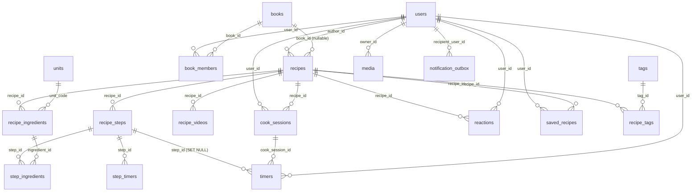
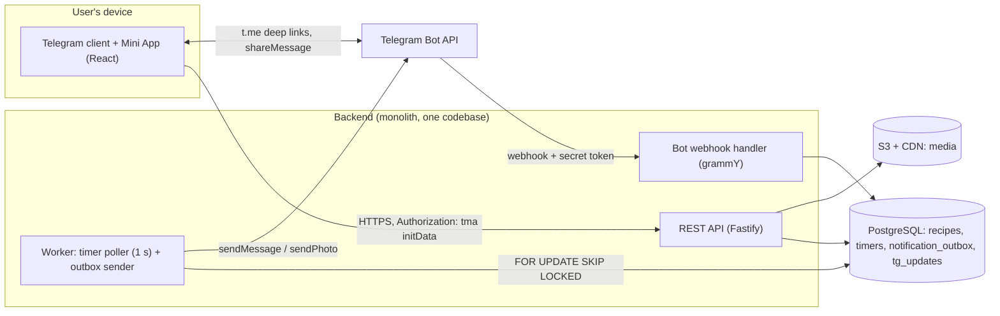

# PRD: Family Cookbook in Telegram (Mini App)

Date: 2026-10-09 · Author: Vlad

> **Reading guide for the implementing engineer (human or AI).**
> This is the English version of the Russian PRD and is the single source of truth for the MVP (Stage 1). Section numbers match the Russian original, so references such as "section 5.3" or "rule 3.3" are stable.
> Conventions: `UC-nn` = use case, `BE-nn` / `FE-nn` / `UX-nn` = backend / frontend / UI-UX task IDs (section 6), `pd` = person-days. Identifiers, enums, field names and API paths are literal. User-facing strings, test fixtures and examples that are in Russian (for example "1 шт. (или взбить 2 шт. и взять ⅔)") are intentionally kept in Russian: they are the exact expected output of the product and must not be translated. The product UI ships in four languages (ru, uk, en, sv); recipe texts are stored in their original language and are never translated.
> If anything here is ambiguous or contradicts the original brief (`docs/BRIEF.md`), this PRD wins; section 1.5 records every such decision. Section 7.5 lists Telegram behaviours that are NOT yet verified: treat them as assumptions, not facts.

The product is a Telegram Mini App: a shared cookbook for a family and friends, with smart recipe recalculation and a step-by-step cooking mode. The goal of the MVP is to launch the loop "shared → cooked step by step → reacted" and to verify its value with a small circle of users.

## 1. Product Overview

### 1.1 Problem and solution

| Problem | Solution in the product |
| --- | --- |
| Recipes are scattered across chats, notes, screenshots and notebooks | One shared book + fast import (paste text, forward a message to the bot) |
| A recipe is written for a different number of servings, or an ingredient is missing | Smart recalculation: by servings, from one product, from several products |
| Cooking from a long text is inconvenient (dirty hands, the screen goes dark, timers) | Cooking mode: one step per screen, swipes, wake lock, server-side timers |
| No feedback that makes people want to share | Reactions and a notification to the author: "Lena cooked your pie" with a photo |
| Installing a separate app is a barrier | Mini App inside Telegram: authorization, link sharing, language and a bot out of the box |

### 1.2 MVP goals and success metrics

| Goal | Metric | Target (hypothesis) |
| --- | --- | --- |
| People add recipes | Share of active users who added ≥1 recipe within 14 days | ≥ 50% |
| Adding is fast | Median time from pasting text to publishing | ≤ 3 min |
| Recipes are really cooked | Number of "👨‍🍳 I cooked it" reactions per 10 recipes per month | ≥ 5 |
| Cooking mode is completed | Share of cooking-mode launches that reach the last step | ≥ 60% |
| Recalculation is useful | Share of recipe opens where recalculation was used | ≥ 25% |
| Timers are reliable | Share of timers for which the bot delivered the notification within ≤ 5 s of the deadline | ≥ 99% |

The target values are starting hypotheses to be agreed with the product owner; the brief does not define them.

### 1.3 Personas

| Persona | Description | Key need |
| --- | --- | --- |
| Keeper (book owner) | Creates the book, invites the family, moves family recipes in | Quickly gather recipes in one place |
| Cook | Cooks from other people's recipes, often to match what is at home | Recalculation and a convenient cooking mode |
| Guest via link | Opens a recipe from a chat, is not a member of the book | See the recipe without registration or extra steps |

### 1.4 MVP scope (Stage 1)

| In the MVP | Not in the MVP (stage) |
| --- | --- |
| Recipe card: photo, ingredients, steps (photo, timer), YouTube linked to a step, difficulty, time, servings, tags, author's notes | Reference of measures and densities, conversion between units (2) |
| Recalculation in the original units: by servings and from one product; smart rounding | Recalculation from several products with a "what is missing" view: the brief describes it as a feature but the MVP roadmap does not list it → moved to stage 2 (see assumptions) |
| Cooking mode with server-side timers and local progress saving | "My version" as a recipe copy, multiple books, gamification (2) |
| One shared book + a personal "Saved" shelf | OCR of page photos, shopping list, "what to cook from what I have", equipment notes (3) |
| Paste text and forward to the bot → drafts | Public catalog, КБЖУ (calories/protein/fat/carbs), menu planner (4) |
| Three visibility levels, link sharing with a preview | |
| Reactions (emotions and actions), notification to the author | |
| Interface in 4 languages: ru, uk, en, sv | |

### 1.5 Assumptions and resolution of ambiguities in the brief

1. **Recalculation from several products.** The brief (item 4) describes it as part of "smart recalculation", but the MVP roadmap only mentions recalculation "in the current units". The idea description (ODT) includes recalculation by servings and from one product in the MVP. Decision: the MVP has servings and one product; several products is stage 2. The algorithm (section 5) is designed so that the extension does not change the data model.
2. **The ✏️ "My version" reaction in the MVP.** Reactions exist from day one, but the "My version" feature (a recipe copy) is stage 2. Decision: in the MVP ✏️ is stored as a reaction with a text note "what I changed"; in stage 2 it gets a link to the forked recipe (field `version_recipe_id`, nullable).
3. **No dislikes.** Instead, there is a soft note to the author (a comment-reaction with text). In the MVP the note is stored as part of the reaction.
4. **Personal book.** "One shared and one personal book" (brief) = the shared book + a personal "Saved" shelf; drafts and recipes with visibility "only me" live in the user's personal space.
5. **Recipe language.** A recipe is stored in its original language, there is no auto-translation; the recipe's `language` field is needed only to choose parsing rules and unit declensions.
6. **Video.** YouTube links only; video files are not uploaded or stored.
7. **Scale.** Load at launch is tens to hundreds of users; the architecture is a monolith, no microservices.

### 1.6 Glossary

| Term | Meaning |
| --- | --- |
| Mini App (Web App) | A web application opened inside Telegram through the Telegram Web App API |
| Book | A shared space of recipes with members; joined by invitation link |
| Personal shelf | The user's private space: drafts and "Saved" |
| Anchor ingredient | An ingredient and its actual available amount, from which the recalculation factor is computed |
| Recalculation factor (k) | The multiplier applied to all amounts of a recipe |
| Countable ingredient (whole item) | A unit that is indivisible in everyday use: an egg, a bay leaf, a garlic clove |
| Non-scalable | Amounts such as "to taste", "a pinch" and similar |
| Server timer | A timer stored and fired on the backend independently of the client |

## 2. User Flows & Use Cases

The three mandatory MVP scenarios (import, recalculation from one product, and the full cooking cycle) are described below step by step: the user's action, the system's behaviour, exceptions and acceptance criteria.

### 2.1 MVP use case catalog

| ID | Use case | Actor | Priority |
| --- | --- | --- | --- |
| UC-01 | Import a recipe by pasting text | Keeper, Cook | P0 |
| UC-02 | Import by forwarding a message to the bot (→ drafts) | Keeper, Cook | P0 |
| UC-03 | Manually create and edit a recipe, publish | Author | P0 |
| UC-04 | Recalculation by servings | Cook | P0 |
| UC-05 | Recalculation from one product | Cook | P0 |
| UC-06 | Cooking mode: steps, timers, progress recovery | Cook | P0 |
| UC-07 | React to a recipe, notify the author | Cook, Author | P0 |
| UC-08 | Share a recipe by link and view as a guest | Author, Guest | P0 |
| UC-09 | Invite to the book by link | Keeper | P0 |
| UC-10 | Save someone else's recipe to "Saved", search and filters | Cook | P1 |
| UC-11 | Change the interface language | Any | P0 |

The ones that need non-trivial logic are described in detail: UC-01/02, UC-05, UC-06 (+ part of UC-07).

### 2.2 Scenario a) Import a recipe from text (UC-01, UC-02)

**Preconditions:** the user is authorized through Telegram and is a member of a book (or works in the personal space). **Result:** a recipe with status `draft` or `published`.

**Variant A: paste into the Mini App (UC-01)**

| # | Actor | Action / system behaviour |
| --- | --- | --- |
| 1 | User | Taps "＋" → "Paste recipe text" |
| 2 | User | Pastes the copied text (limit 20,000 characters) and taps "Parse" |
| 3 | Client | `POST /recipes/import` with `{text, ui_lang}`; shows a loading indicator |
| 4 | Server | Normalizes the text, splits it into sections (title / ingredients / steps / notes), parses ingredient lines and steps, extracts durations for timers, servings, YouTube links (algorithm: section 5.1) |
| 5 | Server | Creates the recipe with `status=draft`, `visibility=private`; returns the structure and a `confidence` per line |
| 6 | Client | Opens the review screen: the original text on the left / top, the parsed ingredients and steps below; lines with `confidence < 0.7` are highlighted |
| 7 | User | Edits the title, ingredients, steps; drags lines between sections; accepts or rejects suggested timers; links ingredients to steps (auto-suggested from mentions in the text) |
| 8 | User | Adds a photo, difficulty, time, tags, servings (servings are required for recalculation, default 4) |
| 9 | User | Chooses "Save draft" (`private`) or "Publish" to the book (`book`) |
| 10 | Server | Validation on publish: title, ≥1 ingredient, ≥1 step, servings > 0. If it passes, `status=published` and the "New recipe in the book" notification is queued for the members |

**Variant B: forwarding to the bot (UC-02)**

| # | Actor | Action / system behaviour |
| --- | --- | --- |
| 1 | User | Forwards a text message with a recipe to the bot (or writes the text to the bot directly) |
| 2 | Bot webhook | Receives `update.message`; checks that `from.id` is registered. If not, replies with an "Open the book" button (registration on first launch) |
| 3 | Bot webhook | Deduplicates by `(chat_id, message_id)`; takes `text` or `caption`; a forward without text → reply "I can't see any text" |
| 4 | Server | Creates a draft (`source=bot_forward`, `raw_text` saved), runs the same parser; a photo from the message (if any) is downloaded to storage as the cover |
| 5 | Bot | Replies: "Recipe «…» saved to drafts" + an inline Web App button "Review" with `startapp=draft_<id>` |
| 6 | User | Opens the Mini App directly on the draft review screen; then steps 6–10 of variant A |

**Exceptions and edge cases**

| Situation | Behaviour |
| --- | --- |
| Text is empty or longer than the limit | Validation error with a hint; the text is not lost from the input field |
| "Ingredients" / "Steps" sections not found | Heuristics on line structure (section 5.1); if that does not help, the whole text goes into one step, ingredients stay empty, with a warning |
| An ingredient line is not recognized | Saved as `name = original line`, `amount = null`, `parse_status=unparsed`; recalculation does not touch the line |
| The same message is forwarded again | Deduplication; the bot offers to open the draft that already exists |
| Connection lost on the review screen | Edits are cached locally, autosave every 10 s when a connection is available |

**Acceptance criteria:** the parser handles ≥9 of 10 typical texts in the test set without losing content (the original text is always available in `raw_text`); the `/recipes/import` response ≤ 2 s at p95; the bot replies in ≤ 3 s.

### 2.3 Scenario b) Smart recalculation from one ingredient (UC-05)

**Example:** a recipe for 4 servings, minced meat 800 g, the user has 500 g. Factor k = 500 / 800 = 0.625, servings ≈ 2.5.

| # | Actor | Action / system behaviour |
| --- | --- | --- |
| 1 | User | On the recipe card taps "Recalculate" |
| 2 | Client | Shows a bottom sheet with tabs "Servings" and "From a product" (the "Several products" tab is stage 2 and hidden in the MVP) |
| 3 | User | Chooses "From a product" → a list of ingredients (only those with a numeric amount; "to taste" and "pinch" are unavailable), picks "minced meat" |
| 4 | User | Enters "500"; the unit is pre-filled from the recipe (g) and can be changed to a unit of the same dimension (kg, ml/l) |
| 5 | Client | Computes k locally (no server request): k = available / original; checks the allowed range |
| 6 | Client | Applies k to all ingredients and runs them through the rounding rules (section 5.3); "to taste" and "pinch" stay unchanged |
| 7 | Client | In the card header: "≈ 2.5 servings (k = 0.63)", a banner "Recalculated from: minced meat 500 g" + a "Reset" button |
| 8 | Client | Saves the recalculation state in localStorage (key `recalc:<recipe_id>`) so it can be passed on to cooking mode |

**Rules and edge cases**

| Situation | Behaviour |
| --- | --- |
| The original unit is a cup, the input is in grams | Rejected: "Units do not match. Conversion between measures will appear with the reference" (stage 2); only units of the same dimension are compatible (g/kg, ml/l) |
| k < 0.25 or k > 4 | Warning "Big change: check the time and the size of the pan"; applying is allowed |
| 0 or a negative number is entered | Validation error, recalculation is not applied |
| The ingredient is given as a range ("200–300 g") | The mean (250) is used for k; the range itself is multiplied in full when displayed |
| The ingredient appears in the recipe twice (dough and filling) | The user picks a specific line (the list shows lines, not unique names); a short group hint |
| Timers in steps | Not scaled; when k ≠ 1 a hint "time may differ" is shown next to them |
| Step text with numbers ("add 200 g of flour") | Amounts inside step text are not rewritten; the author is advised to reference ingredients with the placeholders `{ing:<id>}`, and the client substitutes the recalculated value |

**Acceptance criteria:** recalculation is instant (< 50 ms) and works offline; for the test set "1.3 eggs", "0.7 bay leaf", "a pinch of salt" the result matches the table in section 5.3.

### 2.4 Scenario c) Full cooking-mode cycle (UC-06, UC-07)

**Preconditions:** the recipe is published or accessible by link; the user has started a dialog with the bot (without it Telegram does not let the bot write first; see section 4.5).

| # | Actor | Action / system behaviour |
| --- | --- | --- |
| 1 | User | On the recipe card (optionally setting up recalculation first) taps "Cook" |
| 2 | Client | Checks localStorage for an unfinished session `cook:<recipe_id>`. If found → dialog "Continue from step N / Start over" |
| 3 | Client | Shows a "Preparation" screen: the whole recalculated ingredient list with checkboxes ("do I have everything?"). The mode is entered with the "Start" button |
| 4 | Client | Turns on screen-dimming prevention (Screen Wake Lock API; fallback: a hidden looping video); `POST /cook-sessions` for analytics |
| 5 | Client | Renders step N: large text, the step photo, the list of ingredients of this step (already recalculated), a "▶ video at this step" button (if linked), and the step's timer buttons |
| 6 | User | Swipe left = next step, right = previous. The client writes `{step_index, updated_at}` to localStorage on every transition |
| 7 | User | Taps "Timer 10:00" → the client calls `POST /timers` (`recipe_id, step_id, duration_sec, label`) |
| 8 | Server | Creates the timer with `status=running`, `ends_at = now + duration`, queues a job for `ends_at`; returns `ends_at` and `server_now` |
| 9 | Client | Draws the countdown from `ends_at` (corrected by `server_now`); parallel timers are shown as chips at the bottom on any step |
| 10 | Server + bot | At `ends_at` the worker sends the message "⏰ «Тушение голубцов» готово" with a Web App button (deep link to the step) and sets `status=fired` |
| 11 | User | Can cancel a timer (`DELETE /timers/:id` → `cancelled`) or add time (+1 min: a new `ends_at`, the job is rescheduled) |
| 12 | User | Reaches the last step → the "Done!" screen with the buttons "👨‍🍳 I cooked it", "🔁 I'll cook it again", "✏️ My version" |
| 13 | User | Chooses "I cooked it", optionally adds a photo and a comment |
| 14 | Server | `POST /recipes/:id/reactions` (`kind=cooked`); if the author ≠ the cook, a notification with the dish photo is queued for the author; closes the `cook_session` (`finished_at`); the client clears localStorage |

**Exceptions and edge cases**

| Situation | Behaviour |
| --- | --- |
| The app is minimized or closed | Timers keep running on the server; the bot sends the notification; on return the client restores the step from localStorage and re-requests `GET /timers?active=1` |
| Connection lost when starting a timer | The client starts a local timer with a banner "No Telegram notification will arrive"; once the connection is back, an idempotent sync (`client_timer_id`) recomputes `ends_at` from the original start moment |
| Accidental page refresh / Mini App restart | The step, the recalculation and the timers are restored; progress is not reset |
| Several timers expire at the same time | A separate message for each, with the step label and the recipe name |
| Wake Lock is unavailable or denied | Silently switches to the fallback; if that is also unavailable, a one-time toast "Turn off screen auto-lock" |
| The phone went to sleep while the app is open | On `visibilitychange` the client requests Wake Lock again and syncs the timers |
| The author edits the recipe during cooking | The session pins `recipe_version`; cooking finishes on the recipe snapshot cached on the client, and the banner "Recipe updated" is shown afterwards |
| Cook = author | No notification is sent; the reaction is saved |

**Acceptance criteria:** progress is restored after a page reload and in offline mode; the timer notification arrives within ±5 s of `ends_at` even when the app is closed; ≥5 timers run simultaneously; if the cook chooses "I cooked it", the author receives a message with the photo within ≤ 10 s.

## 3. Entity-Relationship Model

The data model is PostgreSQL 15+, 19 tables for the MVP; the center of the model is `recipes`, with ingredients, steps, reactions and timers around it. The schema already provides for stage 2 (multiple books, "My version", the measures reference): the needed fields are nullable, and migrations will not require restructuring the current tables.

The 19 tables: `users`, `books`, `book_members`, `recipes`, `recipe_ingredients`, `units`, `recipe_steps`, `step_ingredients`, `step_timers`, `recipe_videos`, `timers`, `cook_sessions`, `reactions`, `saved_recipes`, `tags`, `recipe_tags`, `media`, `notification_outbox`, `tg_updates`.

Relationship diagram (arrows go from the child table to the parent; `recipes` is the root for ingredients, steps and reactions, and server timers hang off a step and a cooking session):



### 3.1 Relationships between tables

| Relationship | Cardinality | Behaviour on delete |
| --- | --- | --- |
| users → recipes (author) | 1 : N | Recipes stay, `author_id` does not change (the user is marked soft-deleted) |
| books ↔ users (`book_members`) | N : M | CASCADE on `book_members` |
| books → recipes | 1 : N (nullable) | `book_id = NULL` means the recipe is in the personal space only |
| recipes → recipe_ingredients | 1 : N | CASCADE |
| recipes → recipe_steps | 1 : N | CASCADE |
| recipe_steps ↔ recipe_ingredients (`step_ingredients`) | N : M | CASCADE; the `portion_fraction` share lets one ingredient be split between steps |
| recipe_steps → step_timers | 1 : N | CASCADE |
| recipe_steps → timers (runtime) | 1 : N | SET NULL on `step_id`; the timer lives out its term |
| users → cook_sessions → timers | 1 : N, 1 : N | CASCADE from users |
| recipes ↔ users (`reactions`) | N : M with attributes | CASCADE from recipes |
| recipes ↔ users (`saved_recipes`) | N : M | CASCADE |
| recipes ↔ tags (`recipe_tags`) | N : M | CASCADE |
| media → recipes / steps / reactions | 1 : N | RESTRICT; "orphaned" files are cleaned up by a background job |

### 3.2 Tables and fields

**users**: users (created on first sign-in to the Mini App or on the bot's `/start`)

| Field | Type | Description |
| --- | --- | --- |
| `id` | uuid PK | Internal identifier |
| `tg_user_id` | bigint UNIQUE NOT NULL | Telegram ID (also the `chat_id` of the private chat with the bot) |
| `tg_username`, `first_name`, `photo_url` | text | From `initData`, updated on every sign-in |
| `ui_lang` | enum(ru, uk, en, sv) | From `language_code`, can be overridden |
| `bot_started` | bool | True if the user has started a dialog with the bot; false → notifications are undeliverable |
| `notify_prefs` | jsonb | Keys: `timers` (personal timers), `cooked` (someone cooked mine), `new_recipe` (new recipe in the book), each on / off. `mute_social = true` ("quiet mode") turns off `cooked` and `new_recipe`; personal timers keep arriving |
| `created_at`, `last_seen_at`, `deleted_at` | timestamptz | |

**books**, **book_members**: the shared book and its members

| Field | Type | Description |
| --- | --- | --- |
| `books.id` | uuid PK | |
| `books.title` | text | "Семья" ("Family") |
| `books.owner_id` | uuid FK users | The keeper |
| `books.invite_code` | text UNIQUE | Code in `startapp=join_<code>`; can be re-issued |
| `book_members.(book_id, user_id)` | PK | Composite key; in the MVP also UNIQUE (`user_id`): one user, one book (the constraint is dropped in stage 2) |
| `book_members.role` | enum(owner, member) | owner = keeper (creator of the book), member = participant; role permissions are in 3.3. Only two roles in the MVP |
| `book_members.joined_at` | timestamptz | |

**recipes**: the recipe card

| Field | Type | Description |
| --- | --- | --- |
| `id` | uuid PK | |
| `author_id` | uuid FK users | |
| `book_id` | uuid FK books NULL | NULL → personal space only |
| `title` | text NOT NULL | In the original language |
| `status` | enum(draft, published, archived) | Draft until published |
| `visibility` | enum(private, book, link) | The three access levels from the brief |
| `share_token` | text UNIQUE NULL | For `link`; unpredictable, 128 bits |
| `cover_media_id` | uuid FK media NULL | Main photo |
| `difficulty` | enum(easy, medium, hard) NULL | |
| `prep_min`, `cook_min` | int NULL | Preparation and cooking time, separately |
| `servings` | numeric(6,2) NOT NULL | Base number of servings (>0) |
| `language` | char(2) | Language of the recipe text |
| `author_notes` | text NULL | "The dough is better left overnight" |
| `source_type` | enum(manual, paste, bot_forward, ocr) | `ocr` is stage 3 |
| `raw_text`, `source_ref` | text, jsonb | The import source; `chat_id` / `message_id` of the forward for deduplication |
| `version` | int | Incremented when a published recipe is edited |
| `origin_recipe_id` | uuid FK recipes NULL | Stage 2: the recipe a "My version" was made from |
| `search_tsv` | tsvector | GIN index: title + ingredients + tags |
| `created_at`, `updated_at`, `published_at`, `deleted_at` | timestamptz | |

**recipe_ingredients**: ingredients (an item = one line of the recipe)

| Field | Type | Description |
| --- | --- | --- |
| `id` | uuid PK | Stable id for `{ing:<id>}` references from step text |
| `recipe_id` | uuid FK | |
| `position` | int | Order in the list |
| `group_label` | text NULL | "For the dough", "For the cream" |
| `name` | text NOT NULL | "minced beef" |
| `name_norm` | text | Lemma / lower-case for search and the future shopping list |
| `qty_kind` | enum(exact, range, to_taste, pinch, unparsed) | Type of the quantity |
| `amount_min`, `amount_max` | numeric(12,4) NULL | For `exact` both are equal; for `range` they are the bounds |
| `unit_code` | text FK units NULL | Unit code (g, ml, tsp, pcs, …); NULL for `to_taste` / `pinch` |
| `unit_raw` | text | As the author wrote it ("ст. л.") |
| `round_class` | enum(continuous, whole_item, spice_item) | Rounding class; rules in section 5.3 |
| `min_piece` | numeric(4,2) NULL | Divisibility step of a countable ingredient (1 for an egg, 0.5 for an onion) |
| `optional`, `note` | bool, text | "optional", "chopped" |
| `raw_line`, `parse_confidence` | text, real | The original line and the parser's confidence (0–1) |

CHECK: `qty_kind IN (exact, range)` → `amount_min IS NOT NULL`; `to_taste` / `pinch` → `amount_min IS NULL`. A line is recalculated only if `qty_kind IN (exact, range)`.

**units**: dictionary of units (seed data, not editable by users)

| Field | Type | Description |
| --- | --- | --- |
| `code` | text PK | g, kg, ml, l, tsp, tbsp, cup, pcs, clove, bunch, dl, msk, tsk, krm … |
| `dimension` | enum(mass, volume, count, other) | For compatibility checks |
| `to_base` | numeric NULL | Multiplier to the base unit (g, ml), only for exact units (kg→g, l→ml); inexact ones (cup, spoon) are NULL until stage 2 |
| `aliases` | jsonb | Synonyms per language: ru "ст. л.", uk "ст. л.", sv "msk", en "tbsp" |

**recipe_steps**, **step_ingredients**, **step_timers**

| Field | Type | Description |
| --- | --- | --- |
| `recipe_steps.id`, `recipe_id`, `position` | uuid, uuid, int | UNIQUE (recipe_id, position) DEFERRABLE, to allow reordering steps |
| `recipe_steps.title`, `body` | text | Short title (optional) and the step text |
| `recipe_steps.photo_media_id` | uuid FK media NULL | Step photo |
| `recipe_steps.video_id`, `video_start_sec` | uuid FK recipe_videos NULL, int | Links a video to the step (timestamp) |
| `step_ingredients.(step_id, ingredient_id)` | PK | Which ingredients to show at the step |
| `step_ingredients.portion_fraction` | numeric(5,4) DEFAULT 1 | Share of the ingredient used at this step (sum over steps ≤ 1) |
| `step_timers.id`, `step_id`, `position` | | Timer templates of a step (several per step) |
| `step_timers.label`, `duration_sec` | text, int | "Simmer", 5400; CHECK duration_sec between 1 and 86400 |

**recipe_videos**: `id`, `recipe_id`, `youtube_id` (11 characters, validated by regexp), `title` NULL, `position`.

**timers**: server timers (runtime)

| Field | Type | Description |
| --- | --- | --- |
| `id` | uuid PK | |
| `user_id` | uuid FK users | Owner; the notification goes to them |
| `recipe_id`, `step_id`, `cook_session_id` | uuid FK, nullable | Context for the notification text and the deep link |
| `client_timer_id` | uuid | UNIQUE (user_id, client_timer_id), for idempotency |
| `label` | text | Caption in the notification |
| `duration_sec` | int | |
| `started_at`, `ends_at` | timestamptz | `ends_at = started_at + duration` |
| `status` | enum(running, fired, cancelled, failed) | `failed` = the bot could not deliver (the user blocked the bot) |
| `fired_at`, `attempts` | timestamptz, int | Actual send time and number of attempts |

Index: partial `(ends_at) WHERE status = 'running'`, the main query of the timer poller.

**cook_sessions**: cooking sessions (for analytics and future points; the progress itself is stored on the client)

| Field | Type | Description |
| --- | --- | --- |
| `id`, `user_id`, `recipe_id` | uuid | |
| `recipe_version` | int | Recipe version at the start |
| `scale_factor` | numeric(10,6) | Recalculation factor |
| `state` | enum(active, finished, abandoned) | `abandoned` is set automatically after 24 h without activity |
| `started_at`, `finished_at`, `max_step_index` | timestamptz, int | |

**reactions**

| Field | Type | Description |
| --- | --- | --- |
| `id` | uuid PK | |
| `recipe_id`, `user_id` | uuid FK | |
| `kind` | enum(heart, yum, fire, idea, curious, cooked, cook_again, my_version) | Corresponds to ❤️ 😋 🔥 💡 🤔 👨‍🍳 🔁 ✏️ |
| `note` | text NULL | Text such as "turned out a bit salty"; for `my_version`, what was changed |
| `photo_media_id` | uuid FK media NULL | For `cooked` / `my_version` |
| `cook_session_id` | uuid FK NULL | Link to the cooking session |
| `version_recipe_id` | uuid FK recipes NULL | Stage 2: link to a "My version" |
| `created_at` | timestamptz | |

Uniqueness: partial UNIQUE `(recipe_id, user_id, kind)` for the emotions (`heart`, `yum`, `fire`, `idea`, `curious`) and `cook_again`; tapping again removes the reaction. `cooked` can be set many times (a new row each time). There are no dislikes in the model.

**Other tables**

| Table | Fields | Purpose |
| --- | --- | --- |
| `saved_recipes` | `user_id`, `recipe_id`, `saved_at` (PK on the pair) | The personal "Saved" shelf |
| `tags` | `id`, `slug` UNIQUE, `custom_name` NULL | System tags (`soup`, `baking`, `vegan`, `gluten_free`) are localized through i18n; free-form ones go in `custom_name` |
| `recipe_tags` | `recipe_id`, `tag_id` (PK on the pair) | Many-to-many link |
| `media` | `id`, `owner_id`, `storage_key`, `mime`, `width`, `height`, `bytes`, `sha256`, `created_at` | All uploaded photos (covers, steps, "I cooked it" photos) |
| `notification_outbox` | `id`, `type`, `recipient_user_id`, `payload` jsonb, `dedupe_key` UNIQUE, `status`, `attempts`, `run_at`, `sent_at` | Transactional outbox: all outgoing bot messages (section 4.4) |
| `tg_updates` | `update_id` PK, `received_at` | Deduplication of Telegram webhook updates |

### 3.3 Access rules (mandatory at the query level and in Row Level Security)

| Who reads the recipe | `private` | `book` | `link` |
| --- | --- | --- | --- |
| Author | yes | yes | yes |
| Member of the book `book_id` | no | yes | yes, if they are in the book or have the token |
| Anyone with `share_token` | no | no | yes (only `status = published`) |
| Draft (`status = draft`) | author only | author only | author only |

Only the author can edit a recipe (and the keeper of the book can remove someone else's recipe from the book, which turns it into `private` for the author). Only people who have read access can react; link recipients can also react: the Mini App always opens inside Telegram, so they are authorized.

**Role permissions in the book.**

- **Member:** creates, edits and deletes only their own recipes; can leave the book (their recipes with visibility `book` become `private` for the author).
- **Keeper (owner):** everything above, plus moderation: unpublish someone else's recipe (spam, mistaken publication); remove a member (their book recipes become `private` for the author); re-issue `invite_code` if the link ended up in the wrong hands (the old code stops working immediately). The keeper cannot edit the text of someone else's recipe.
- A book is created with `POST /books`: the creator becomes `owner`. In the MVP a user belongs to at most one book (UNIQUE `book_members.user_id`).
- The keeper cannot leave the book until the role is transferred: `POST /books/leave` returns 409 `KEEPER_CANNOT_LEAVE`.
- Transferring the keeper role and having several keepers are post-MVP.

## 4. Integration Architecture (Telegram Web App API)

The Mini App and the bot are two entry points into one monolithic backend: the client talks to the API over HTTPS, the bot receives updates through a webhook, and a separate worker fires due timers once a second and sends messages through the Bot API. The database is the single source of truth for timers and notifications, so a server restart loses nothing.

### 4.1 Components and stack

| Layer | Solution | Rationale |
| --- | --- | --- |
| Client | React 18 + TypeScript + Vite; Telegram Web App SDK; i18next; TanStack Query; Zustand | Same language as the backend; i18n files cover 4 languages without extra complexity |
| API | Node.js 20 + TypeScript, Fastify (REST + JSON, zod schemas) | Shared types with the client, fast start |
| Bot | grammY, webhook mode with the `X-Telegram-Bot-Api-Secret-Token` header | Same process / codebase as the API |
| Worker | A separate process of the same codebase: timers + outbox sender | Scales independently, does not block the API |
| DB | PostgreSQL 15+ (RLS, GIN for search, partial indexes) | Transactionality of the outbox and timers |
| Files | S3-compatible storage + CDN; resize with sharp | Covers, step photos and dish photos |
| Hosting | Containers behind an HTTPS proxy (a Mini App requires HTTPS) | One service + worker + DB is enough for the MVP |

### 4.2 Interaction diagram



App requests go to the API, bot updates go to the webhook, and everything that must fire after the app is closed is done by the worker from data in the database.

### 4.3 Authentication through initData

1. The client takes `Telegram.WebApp.initData` and sends it in every request in the header `Authorization: tma <initData>`.
2. The server verifies the signature: secret key = HMAC_SHA256(key `"WebAppData"`, bot token); hash = HMAC_SHA256(secret key, the sorted `key=value` pairs without `hash`, joined by `\n`); the comparison is constant-time.
3. The freshness of `auth_date` is checked (not older than 24 h; for write operations, a configurable window).
4. The `users` row is found or created by `user.id`; `user.language_code` sets `ui_lang` on creation (ru, uk, en, sv; any other code → en).
5. Separate sessions and passwords are not needed: the HMAC check is cheap and runs on every request.

No data from `initDataUnsafe` on the client is considered trusted: only what the server has verified.

### 4.4 The bot and outgoing notifications

**Incoming (webhook).** The bot handles: `/start [payload]` (registration, deep link), forwarded or plain text messages (UC-02), `my_chat_member` (the user blocked the bot → `bot_started = false`). Updates are deduplicated by `update_id` (`tg_updates`).

**Outgoing (transactional outbox).** Every message to a user is first written to `notification_outbox` in the same transaction as the business change. The sender takes rows with `FOR UPDATE SKIP LOCKED`, sends them through the Bot API and marks them `sent`.

| Type | Trigger | Recipient | Content | Button |
| --- | --- | --- | --- | --- |
| `timer_fired` | The timer's `ends_at` is reached | Timer owner | "⏰ {label} — done! {recipe title}, step {n}" | Web App: open at the step |
| `recipe_cooked` | A `cooked` reaction from another user | Recipe author | "{Name} cooked «{title}»" + dish photo + note | Web App: open the recipe |
| `new_recipe` | A recipe is published to the book | Book members except the author | "{Name} added «{title}»" | Web App: open the recipe |

Delivery rules:

- The message language = the recipient's `ui_lang`; texts live in the same translation files.
- Emotions (❤️ 😋 🔥 💡 🤔) and 🔁 do not trigger notifications in the MVP (assumption: spam protection).
- `new_recipe`: if more than 3 recipes are published in a book within 10 minutes, they are collapsed into one message "N new recipes in the book".
- Idempotency: `dedupe_key` = `timer:<id>`, `cooked:<reaction_id>`, `new:<recipe_id>:<user_id>`.
- Retries: exponential delay (1 s, 5 s, 30 s, 5 min), at most 5 attempts; on HTTP 429 the `retry_after` is respected.
- A 403 response ("bot blocked") → `users.bot_started = false`, that user's timers get `failed`, and the client shows a warning.
- Telegram limits: about 30 messages per second per bot and about 1 per second per chat. The sender keeps a throttled queue; `timer_fired` messages have priority.
- The photo in `recipe_cooked` is sent with `sendPhoto` by the URL of a downscaled copy (caption ≤ 1024 characters).

### 4.5 Telegram restriction: the bot cannot write first

The bot can write to a user only after the user's permission. Scenario: on first launch the client reads `initDataUnsafe.user.allows_write_to_pm`; if there is no permission, before the first timer or publication a screen with an explanation is shown ("The bot will send you a message when the timer ends") and `Telegram.WebApp.requestWriteAccess()` is called. If the user refuses, the button "Open chat with the bot" leads to `/start`. Without permission the app works, but timers are marked "notification will not arrive".

### 4.6 Server timers

**Lifecycle:**

| Status | When | Transition |
| --- | --- | --- |
| `running` | `POST /timers` | → `fired`, `cancelled` |
| `fired` | The worker put the message into the outbox | → `failed` if the outbox exhausts its attempts |
| `cancelled` | `DELETE /timers/:id` | terminal state |
| `failed` | The message was not delivered | terminal state, visible to the client |

**Worker (1-second tick):**

```sql
BEGIN;
SELECT id, user_id, recipe_id, step_id, label
  FROM timers
 WHERE status = 'running' AND ends_at <= now()
 ORDER BY ends_at
   FOR UPDATE SKIP LOCKED
 LIMIT 50;
-- for each row:
--   INSERT INTO notification_outbox (type, recipient_user_id, payload, dedupe_key, run_at)
--     VALUES ('timer_fired', user_id, payload, 'timer:' + id, now())
--     ON CONFLICT (dedupe_key) DO NOTHING;
--   UPDATE timers SET status = 'fired', fired_at = now() WHERE id = ...;
COMMIT;
```

Several worker instances are safe thanks to `SKIP LOCKED`; after a server outage, overdue timers are processed on the very first tick (with a "late" mark in the log).

**Latency budget:** polling up to 1 s + outbox sending up to 1 s + a Bot API call of about 0.3–1 s → usually ≤ 3 s, target ±5 s from `ends_at`.

**Client synchronization:**

1. `POST /timers` accepts `client_timer_id` (a UUID from the client) → repeating the request does not create a duplicate.
2. The response contains `ends_at` and `server_now`; the client computes the offset `offset = server_now − Date.now()` and draws the remainder as `ends_at − (Date.now() + offset)`, not trusting the device clock.
3. On `visibilitychange → visible` and when cooking mode starts, the client does `GET /timers?active=1` and rebuilds the chips.
4. When a timer reaches zero while the app is open: haptic feedback (`notificationOccurred('warning')`) and a large banner; the bot message is still sent (an MVP decision; the question of suppressing duplicates is in section 7).
5. Limits: up to 10 active timers per user, duration from 1 s to 24 h.
6. Offline: the client starts a local timer marked "no Telegram notification will arrive", and when the connection returns it sends `POST /timers` with `started_at` and the recomputed `ends_at` (if it is still in the future).

Finished timers are kept for 7 days and then deleted by a background job.

### 4.7 Deep links and sharing

Link format: `https://t.me/<bot>/<app>?startapp=<payload>`; the value arrives in `initDataUnsafe.start_param`. The payload is designed to fit a limit of 64 characters from the set A–Z, a–z, 0–9, `_`, `-` (the limit should be re-checked against the current Telegram documentation).

| Payload | Action on open |
| --- | --- |
| `r_<share_token>` | A recipe by link (visibility `link`) |
| `rc_<uuid without dashes>` | A book recipe (membership required) |
| `join_<invite_code>` | Join a book |
| `draft_<uuid without dashes>` | Draft review screen (from the bot) |
| `cook_<uuid>_<step number>` | Cooking mode at the given step (from a timer notification) |

**Recipe preview in a chat: a key finding.** A link like `t.me/<bot>/<app>?startapp=…` shows the generic app card in the chat (the name, picture and description are set in BotFather), not the card of a specific recipe. To get a preview with the recipe's photo and title, sharing is done through a prepared message:

1. The client calls `POST /recipes/:id/share`.
2. The backend calls the Bot API `savePreparedInlineMessage` (the result is the recipe photo, the title and an "Open recipe" button with the link above) and returns an `id`.
3. The client calls `Telegram.WebApp.shareMessage(id)` (Bot API 8.0+); the chat picker opens.
4. Fallback for old clients: `t.me/share/url?url=<link>&text=<title>` (the preview will be generic).

Before implementation, the exact set of `savePreparedInlineMessage` parameters and the behaviour on iOS and Android must be confirmed with a test bot.

### 4.8 Client state and offline

| localStorage key | Content | Cleanup |
| --- | --- | --- |
| `cook:<recipe_id>` | Cooking state (structure below) | After finishing, or after 24 h of inactivity |
| `recalc:<recipe_id>` | Recalculation parameters (mode, product, amount, k) | On "Reset" or after cooking |
| `import-draft` | Unsaved import text and edits on the review screen | After saving |
| `ui_lang` | Manual language choice | — |

Cooking state:

```json
{
  "v": 1,
  "recipe_id": "…",
  "recipe_version": 3,
  "scale": { "mode": "ingredient", "ingredient_id": "…", "amount": 500, "unit": "g", "k": 0.625 },
  "step_index": 2,
  "checked_ingredients": ["…"],
  "timers": [{ "client_timer_id": "…", "server_id": "…", "step_id": "…", "ends_at": "…", "synced": true }],
  "updated_at": "…"
}
```

The state is written on every step change and every timer change (debounce 300 ms). In addition, the client sends, with a delay, `PATCH /cook-sessions/:id { max_step_index }` as a backup: if the WebView cleared localStorage, cooking can be resumed from the server (best effort, the UI is not blocked). For recipes and images, the TanStack Query cache and the CDN's HTTP cache are used, so an already opened recipe card can be read without a network.

### 4.9 MVP REST API

| Method and path | Purpose |
| --- | --- |
| `GET /me` | Profile, language, `bot_started` |
| `PATCH /me` | Interface language, `notify_prefs` (including quiet mode) |
| `POST /books` | Create a book (title); the creator becomes `owner`. Idempotent; only for a user who is not yet in a book |
| `POST /books/join` | Join by `invite_code` |
| `GET /books/current` | The book and its members |
| `DELETE /books/current/members/:user_id` | Remove a member (keeper only); their book recipes become `private` |
| `POST /books/current/invite/rotate` | Re-issue `invite_code` (keeper only); the old code is invalid immediately |
| `POST /books/leave` | Leave the book (member); the keeper gets 409 `KEEPER_CANNOT_LEAVE` (role transfer is post-MVP) |
| `GET /recipes` | List with search and filters (`q`, `tag`, `difficulty`, `max_min`, `scope=book/mine/saved`) |
| `POST /recipes` | Create (manual entry) |
| `POST /recipes/import` | Parse pasted text → draft |
| `GET /recipes/:id`, `GET /r/:share_token` | Recipe card (by membership or by token) |
| `PATCH /recipes/:id` | Edit, change `visibility` and `status` |
| `POST /recipes/:id/unpublish` | Unpublish a recipe (keeper or author): visibility → `private` |
| `DELETE /recipes/:id` | Soft delete |
| `POST /recipes/:id/share` | Prepare a message for sharing |
| `POST /recipes/:id/save`, `DELETE /recipes/:id/save` | "Saved" |
| `POST /recipes/:id/reactions`, `DELETE /reactions/:id` | Reactions |
| `POST /media` | Photo upload (multipart, type and size check) |
| `POST /cook-sessions`, `PATCH /cook-sessions/:id` | Cooking session |
| `POST /timers`, `GET /timers?active=1`, `PATCH /timers/:id`, `DELETE /timers/:id` | Server timers |
| `POST /bot/webhook` | Incoming Telegram updates (secret token check) |

Recalculation, rounding and parsing of ingredient text lines (other than the initial import) run on the client using the shared `recipe-core` library (TypeScript), which is also used on the server for import and is tested with a single test suite (section 5).

## 5. Parsing and Recalculation Algorithms

Text parsing is a deterministic pipeline of rules and dictionaries for 4 languages (no LLM in the MVP: predictable results, zero cost per request); recalculation is a pure function "recipe + factor → amounts to display". Both algorithms live in one TypeScript library, `recipe-core`, with no dependency on the browser or the server.

> Dictionaries, grammar tokens and test inputs below are data in ru / uk / sv / en and are intentionally not translated.

### 5.1 Parsing recipe text

**5.1.1 Pipeline**

| # | Stage | What it does | Result |
| --- | --- | --- | --- |
| 1 | Normalization | Unicode NFC; NBSP → space; fractions (½ ¼ ¾ ⅓ ⅔, `1/2`, `1 1/2`) → number; decimal comma → dot; all dashes → `-`; remove list markers and emoji; YouTube links are moved to `videos` | Clean text, `videos[]` |
| 2 | Segmentation | Section headings from the dictionary (5.1.2); without headings, lines are classified by a score | `title`, ingredient lines, step blocks, notes |
| 3 | Metadata | Servings and time are taken only from explicit phrases ("на 4 порции", "время: 40 мин", "Serves 4", "Portioner: 4"); difficulty is never guessed | `servings`, `prep_min`, `cook_min` or empty |
| 4 | Ingredients | Parse every line (5.1.3) | `recipe_ingredients` structure + `confidence` |
| 5 | Steps | Split into steps, find durations, link ingredients (5.1.4) | `recipe_steps`, timer and link suggestions |
| 6 | Scoring | Lines with `confidence < 0.7` are marked in the UI | For the review screen |

**5.1.2 Heading dictionary and segmentation**

A heading is a line of at most 40 characters, without a trailing period (a colon is allowed), that matches the dictionary case-insensitively.

| Section | ru | uk | en | sv |
| --- | --- | --- | --- | --- |
| Ingredients | Ингредиенты, Состав, Продукты | Інгредієнти, Склад, Продукти | Ingredients | Ingredienser |
| Steps | Приготовление, Способ приготовления, Как готовить, Шаги | Приготування, Спосіб приготування, Кроки | Directions, Method, Instructions, Steps | Gör så här, Tillagning, Instruktioner |
| Notes | Советы, Заметки, Примечание | Поради, Нотатки | Notes, Tips | Tips, Anteckningar |

If there are no headings, each line gets a score:

```text
S_ing = 0.35 * [starts with a digit or a list marker]
      + 0.30 * [contains a unit from the dictionary]
      + 0.20 * [length <= 60]
      + 0.15 * [no trailing period]
```

A line is an ingredient if S_ing ≥ 0.6. A line is a step marker (this has priority over the score) if it matches `^\d+[.)]\s`, or its length is > 80 characters, or it ends with a period and contains ≥6 words. The first non-empty line shorter than 100 characters before the first section is the `title`.

**Sections inside the ingredient list.** A line without a quantity and unit that ends with a colon or starts with "Для …" / "For …" / "För …" is treated as a subheading. Its text becomes `group_label` for all following lines until the next subheading or the end of the block; lines before the first subheading get `NULL`. Recalculation works per line and is not affected by grouping. The recipe card shows ingredients grouped by section; in cooking mode, when there are several sections, the section name is shown next to a step's ingredient ("мука · для теста", i.e. "flour · for the dough") so that identical products are not confused. If a subheading is mistaken for an ingredient or vice versa, it is fixed on the review screen.

**5.1.3 Parsing an ingredient line**

First, explanations in parentheses are cut out of the line (they go to `note`), then the patterns are tried in order:

```text
NUM    = \d+([.,]\d+)? | \d+\s+\d/\d | \d/\d | unicode-fraction
RANGE  = NUM\s*-\s*NUM
UNIT   = alias from units.aliases[language] (longest match, the period is optional)
TASTE  = по вкусу | на вкус | до смаку | за смаком | to taste | efter smak
PINCH  = щепотка | щіпка | pinch | nypa | knivsudd

P1: PINCH NAME               → pinch          "щепотка соли"
P2: NAME TASTE               → to_taste       "соль по вкусу"
P3: (RANGE|NUM) UNIT? NAME   → exact/range    "2 ст. л. муки"
P4: NAME - (RANGE|NUM) UNIT? → exact/range    "яйца — 4 шт."
P5: NAME                     → to_taste if the name is in the spice dictionary (salt, pepper), otherwise unparsed
```

After parsing: the unit is mapped to a code from `units`; `round_class` and `min_piece` are assigned from the product dictionary (egg: `whole_item`, 1; onion: `whole_item`, 0.5; garlic clove: `whole_item`, 1; bay leaf, clove, peppercorn: `spice_item`, 1; everything else: `continuous`).

| Input | Type | Amount | Unit | Name | Confidence |
| --- | --- | --- | --- | --- | --- |
| «2 ст. л. муки» | exact | 2 | tbsp | муки | 1.0 |
| «800 г говяжьего фарша» | exact | 800 | g | говяжьего фарша | 1.0 |
| «1½ стакана молока» | exact | 1.5 | cup | молока | 1.0 |
| «яйца — 4 шт.» | exact | 4 | pcs | яйца | 0.9 |
| «200–300 мл воды» | range | 200–300 | ml | воды | 1.0 |
| «2 msk mjöl» | exact | 2 | msk | mjöl | 1.0 |
| «щепотка соли» | pinch | — | — | соли | 1.0 |
| «соль по вкусу» | to_taste | — | — | соль | 1.0 |
| «1 банка томатов (400 г)» | exact | 1 | jar | томатов, note «400 г» | 0.8 |
| «лавровый лист» | unparsed | — | — | лавровый лист | 0.5 |

`confidence` = 1.0 minus 0.1 for pattern P4, minus 0.2 for no unit when the amount is non-empty, minus 0.2 for a parenthetical explanation containing a number, minus 0.5 for P5 when the name is not in the spice dictionary. Below 0.7 the line is highlighted on the review screen.

**5.1.4 Steps, timers and ingredient linking**

- Splitting into steps: by markers `1.` / `1)` / `Шаг 1`; if there are none, by blank lines; otherwise every sentence longer than 40 characters that starts with a verb is a separate step. Continuation lines are glued to the previous step.
- Duration: `(\d+(?:[.,]\d+)?)(?:\s*-\s*(\d+(?:[.,]\d+)?))?\s*(часов|часа|час|ч|минуты|минут|минуту|мин|сек|hours?|h|minutes?|min|sec|timmar?|timme|minuter?|sek)` with word boundaries respected. Every match is a timer suggestion (the label = the text fragment around it). For a range such as "10–15 мин" the lower bound is used and the upper one is mentioned in the label. On the review screen the user accepts or rejects the time.
- Ingredient linking: for each step the algorithm looks for an occurrence of the stem of an ingredient name (the first 5 letters of the word, at least 3 letters, case-insensitive; a light stemming for ru/uk/sv/en). Found links are offered as chips with `portion_fraction = 1`. If an ingredient occurs in several steps, the user distributes the shares manually (sum ≤ 1).

**Quality criterion:** a reference set of 10 recipes (ru × 4, uk × 2, en × 2, sv × 2): section boundaries are determined correctly in ≥ 90% of texts, and the fields "amount + unit + name" are correct in ≥ 90% of ingredient lines; the original text is never lost, whatever the errors.

### 5.2 Recalculation math

Notation: S₀ = servings of the recipe, aᵢ = amount of ingredient i (for a range, the midpoint), k = recalculation factor. Only ingredients with `qty_kind` = exact or range are scaled. Displayed amount: xᵢ = k · aᵢ, then rounding (5.3). The exact k is stored with 6 decimal places; only what the user sees is rounded.

| Mode | Input | Formula for k | Result | Stage |
| --- | --- | --- | --- | --- |
| By servings | Target servings S | k = S / S₀ | Amounts recalculated | MVP |
| From one product j | Available Aⱼ (same unit or a compatible one: g/kg, ml/l) | k = Aⱼ / aⱼ | Servings S = S₀ · k | MVP |
| From several products J | Availability Aⱼ for j ∈ J | k* = min over j of (Aⱼ / aⱼ); the limiting product = argmin | Servings S = S₀ · k*; shortage for the desired servings: needⱼ = max(0, kₜ · aⱼ − Aⱼ) | Stage 2 |

```text
k = A_j / a_j,    x_i = k * a_i,    S = S_0 * k
```

Input units are converted to the ingredient's unit through `units.to_base` (kg → g, l → ml). If `to_base` of either unit is NULL or the dimensions differ (cup → grams), the system refuses (the density reference is stage 2).

```ts
type Scaled = { exact: [number, number] | null; shown: string; hint?: Hint };

function factorFromIngredient(ing: Ingredient, available: number, unitIn: UnitCode): number {
  if (!isScalable(ing)) throw new RecalcError('NOT_SCALABLE');
  const base = (ing.amountMin + ing.amountMax) / 2;
  const a = convert(available, unitIn, ing.unitCode);   // throws UNIT_MISMATCH
  if (!(a > 0) || !(base > 0)) throw new RecalcError('BAD_INPUT');
  return a / base;
}

function scaleRecipe(r: Recipe, k: number): Scaled[] {
  return r.ingredients.map(ing => {
    if (!isScalable(ing)) return { exact: null, shown: ing.rawLine };   // to taste, pinch
    if (k === 1) return { exact: [ing.amountMin, ing.amountMax], shown: format(ing, ing.amountMin, ing.amountMax) };
    const lo = ing.amountMin * k, hi = ing.amountMax * k;
    const a = roundByClass(lo, ing), b = roundByClass(hi, ing);
    return { exact: [lo, hi], shown: format(ing, a.value, b.value), hint: a.hint };
  });
}
```

At k = 1 the numbers are shown as the author wrote them, without rounding. The "big change" warning appears at k < 0.25 or k > 4; a refusal happens at k < 0.05 or k > 20. Times in timers and numbers inside step text are not scaled.

> Implementation note: the engine should return structured quantities (for example `{ whole, fraction: {num, den} | null, rawFloat, unit, rounding, hint?, scalable }`) and leave the final string formatting (Unicode fractions such as ¼ ½ ⅔, locale-specific unit words) to a separate locale-aware formatter. The `shown: string` field above is the formatter's output in the pseudocode, not a requirement to build strings inside the scaling function. Never compare floats with `===` in production code (the `k === 1` shortcut above is only pseudocode: use an epsilon or rational arithmetic).

### 5.3 Smart rounding

The rule is chosen by the ingredient's `round_class` and its unit. A tie (exactly half a step) rounds up; to be safe from floating-point errors, an epsilon of 1e-9 is added in the formula.

**Class `continuous` (g, ml, kg, l).** The rounding step depends on the magnitude; the relative error is at most 5%:

| Value x (in the base unit, g or ml) | Step |
| --- | --- |
| x < 1 | 0.05 |
| 1 ≤ x < 5 | 0.1 |
| 5 ≤ x < 20 | 0.5 |
| 20 ≤ x < 100 | 1 |
| 100 ≤ x < 500 | 5 |
| 500 ≤ x < 2000 | 10 |
| x ≥ 2000 | 50 |

For kg and l the step is applied to the value converted to g / ml; the unit on screen stays the author's.

**Spoons and cups** (tsp, tbsp, cup, and also dl, msk, tsk, krm). The step is a multiple of a fraction a person can actually measure:

| Unit | x < 1 | 1 ≤ x < 4 | x ≥ 4 |
| --- | --- | --- | --- |
| tsp, tsk, krm | 1/8 | 1/4 | 1/2 (from 10: 1) |
| tbsp, msk | 1/4 | 1/2 | 1 |
| cup, dl | 1/4 | 1/4 | 1/2 |

Fractions are displayed as ¼ ½ ¾ ⅓ ⅔ and mixed numbers (1¼).

**Class `whole_item` (egg, onion, garlic clove, piece).** The step is `min_piece` m (1 or 0.5):

```ts
function roundWhole(x: number, m: number): { value: number; hint?: Hint } {
  let n = Math.max(m, floorHalfUp(x / m) * m);               // nearest multiple of m, at least m
  if (Math.abs(x - n) / x <= 0.10 || m < 1) return { value: n };  // error <= 10%: no hint
  const FR = [1/4, 1/3, 1/2, 2/3, 3/4];
  const snap = (v: number) => FR.find(f => Math.abs(v - f) <= 0.04);
  const c = Math.ceil(x), f1 = snap(x / c);                     // H1: take c pieces and use the fraction f (eggs: whisk c, take f)
  if (f1 && c > 1) return { value: n, hint: { kind: 'take_fraction_of', pieces: c, fraction: f1 } };
  const lo = Math.floor(x), f2 = snap(x - lo);                   // H2: lo pieces and another fraction f of one
  if (f2 && lo >= 1) return { value: n, hint: { kind: 'whole_plus_fraction', whole: lo, fraction: f2 } };
  return { value: n };
}
```

**Hint wording (owner decision, Sprint 3).** Only eggs can be whisked and then measured, so the H1 hint depends on the product:

| Product | H1 hint, ru | uk | en | sv |
| --- | --- | --- | --- | --- |
| Eggs | или взбить 2 шт. и взять ⅔ | або збити 2 шт. і взяти ⅔ | or whisk 2 pcs and take ⅔ | eller vispa 2 st och ta ⅔ |
| Other whole items (garlic, pieces) | или взять 2 зубчика и использовать ⅔ | або взяти 2 зубчики і використати ⅔ | or take 2 cloves and use ⅔ | eller ta 2 klyftor och använd ⅔ |

The H2 hint is the same for every whole item ("или 2 шт. и ½ ещё одного"). An ingredient counts as an egg by its name (яйцо, яйця, egg, ägg; not "eggplant").

**The unit word inside a hint (owner's Sprint 6 answer 4).** A hint's words are in the reader's interface language, but its unit word is in the language of the ingredient line it belongs to (the recipe's), so a line never mixes "2 pcs" and "1 шт.": an English reader of a Russian recipe sees "1 шт. (or whisk 2 шт. and take ⅔)". The table above shows each language for a recipe in that same language.

**Class `spice_item` (bay leaf, clove, peppercorn).** A whole number, not less than 1: `n = max(1, floorHalfUp(x))`, no hints (spices tolerate error).

**Not scaled:** `to_taste`, `pinch`, `unparsed` are shown as they are.

**Ranges:** each bound is rounded separately; if the bounds coincide, a single number is shown. The `hint` texts are produced at the UI level through i18n keys (for example `hint.take_fraction_of`), so the hint text is localized.

### 5.4 Verification examples (test cases for recipe-core)

A recipe for 4 servings; minced meat 800 g, the user has 500 g → k = 500 / 800 = 0.625, servings ≈ 2.5.

| Ingredient | Class | Original | x = k · a | Displayed (expected ru output, exact) |
| --- | --- | --- | --- | --- |
| Фарш (minced meat) | continuous | 800 г | 500 | 500 г |
| Яйца (eggs) | whole_item, m = 1 | 4 шт. | 2.5 | 3 шт. (или 2 шт. и ½ ещё одного) |
| Мука (flour) | cup | 2 стакана | 1.25 | 1¼ стакана |
| Сметана (sour cream) | tbsp | 3 ст. л. | 1.875 | 2 ст. л. |
| Лавровый лист (bay leaf) | spice_item | 2 шт. | 1.25 | 1 шт. |
| Соль (salt) | to_taste | по вкусу | — | по вкусу |

Examples from the brief (checked against the code in 5.3):

| Original | k | x | Algorithm steps | Result |
| --- | --- | --- | --- | --- |
| Egg, 1 pc | 1.3 | 1.3 | n = 1; error 23% > 10%; c = 2, x / c = 0.65 → ⅔ (difference 0.017) | 1 шт. (или взбить 2 шт. и взять ⅔) |
| Bay leaf, 1 pc | 0.7 | 0.7 | spice_item: max(1, round(0.7)) | 1 шт. |
| A pinch of salt | any | — | not scaled | щепотка соли |

**Properties verified by property-based tests:** (1) at k = 1 the output equals the original; (2) rounding is monotonic: x₁ ≤ x₂ ⇒ round(x₁) ≤ round(x₂); (3) idempotence: round(round(x)) = round(x); (4) `to_taste` / `pinch` / `unparsed` never change for any k; (5) the relative error of class `continuous` is ≤ 5% on random x in [1; 5000]; (6) the result of `whole_item` is always ≥ m.

## 6. MVP Technical Plan (Stage 1)

The MVP fits into 12 weeks (6 sprints of 2 weeks) with a team of one backend developer, one frontend developer and a designer at 50%; 133 person-days in total, estimate accuracy ±30%. Risky tasks (timers, cooking mode, parser) are scheduled early so that uncertainty is removed before the end of the project, not at the end of it.

**Sprint plan: timers are delivered by sprint 4, the beta with the family by sprint 6**

| Sprint | Weeks | Backend | Frontend | UX and QA | Demo at the end of the sprint |
| --- | --- | --- | --- | --- | --- |
| 1 | 1–2 | Skeleton, auth, books, permissions | SPA skeleton, book list | Design system, navigation | Sign-in through Telegram |
| 2 | 3–4 | Recipe CRUD, media | Recipe card, recalculation core | Editor, import review screen | A recipe in the book |
| 3 | 5–6 | Import parser, search | Recipe editor, recalculation panel | Cooking-mode mockups, parser tests | Import from text |
| 4 | 7–8 | Outbox, server timers | Import, cooking mode | Recalculation, reactions, API autotests | Timer push in the bot |
| 5 | 9–10 | Bot, reactions, sharing | Timers in the UI, reactions, photo | 4-language texts, device testing | Cooking + reaction |
| 6 | 11–12 | Metrics, alerts, backups, reserve | Sharing, onboarding, offline | Usability test, worker load test | Beta with the family |

Sprints are not shown to scale; the tasks with identifiers are in the tables below. The sprint column in those tables is authoritative.

### 6.1 Plan assumptions

| Parameter | Value |
| --- | --- |
| Team | 1 backend, 1 frontend, 1 designer (50%); QA is done by the developers and the designer |
| Sprint | 2 weeks; developer capacity is 10 person-days |
| Estimate | in person-days (pd), ±30% |
| Translations | ru and en are prepared by the team; uk and sv by native speakers from the owner's circle (critical for sv: measures and terms) |

### 6.2 Backend tasks

| ID | Task and result | pd | Sprint | Depends on |
| --- | --- | --- | --- | --- |
| BE-01 | Skeleton: monorepo (`apps/api`, `apps/worker`, `apps/web`, `packages/recipe-core`), CI, Docker, two environments, DB migrations | 3 | 1 | — |
| BE-02 | Authentication by initData, `users`, `GET /me` | 3 | 1 | BE-01 |
| BE-03 | Books: `books`, `book_members`, `join_` invitations, access rules 3.3 and RLS | 4 | 1 | BE-02 |
| BE-04 | Recipe CRUD (ingredients, steps, step↔ingredient links, timer templates, videos, tags), validation, recipe version | 6 | 2 | BE-03 |
| BE-05 | Media: upload, type and size check (≤ 10 MB), EXIF removal, resize, S3 + CDN, cleanup of orphaned files | 3 | 2 | BE-01 |
| BE-06 | Import parser (`recipe-core/parse`): 4-language dictionaries, segmentation, ingredients (including subheadings such as «Для теста:» → `group_label`), steps, timers, `POST /recipes/import`, reference test set | 8 | 3 | BE-04 |
| BE-11 | Search and filters: `tsvector` + GIN, filters by tag, difficulty, time | 2 | 3 | BE-04 |
| BE-08 | Outbox and notification sender: `FOR UPDATE SKIP LOCKED`, retries, handling of 429 and 403, templates in 4 languages | 4 | 4 | BE-02 |
| BE-09 | Server timers: API, worker with a 1 s tick, idempotency, `server_now`, limits | 5 | 4 | BE-08 |
| BE-07 | Bot: webhook, `/start`, deep links, forward → draft, deduplication, `my_chat_member` | 4 | 5 | BE-06, BE-08 |
| BE-10 | Reactions, `saved_recipes`, `recipe_cooked` and `new_recipe` notifications (with collapsing) | 3 | 5 | BE-08 |
| BE-12 | Sharing: `share_token`, `savePreparedInlineMessage`, fallback | 3 | 5 | BE-04, BE-07 |
| BE-13 | `cook_sessions`, analytics events (the metrics from 1.2) | 2 | 6 | BE-09 |
| BE-14 | Observability: logs, the "timer delay" metric, alerts, DB backups and restore verification | 3 | 6 | BE-01 |
| | Total | 53 | | |

The remaining 5 pd in sprint 6 are a reserve for fixes after testing.

### 6.3 Frontend tasks

| ID | Task and result | pd | Sprint | Depends on |
| --- | --- | --- | --- | --- |
| FE-01 | SPA skeleton: Vite, routing, Telegram SDK (BackButton, theme, safe area, `start_param` parsing), API client, i18n for 4 languages | 4 | 1 | BE-01 |
| FE-02 | Book list, search, filters, "Saved" | 4 | 1 | FE-01, UX-02 |
| FE-03 | Recipe card: gallery, ingredients, steps, embedded YouTube, reactions block (markup) | 5 | 2 | FE-01, UX-02 |
| FE-06 | `recipe-core/recalc`: recalculation, rounding, fractions, i18n hints; unit and property tests per 5.4 | 5 | 2 | — |
| FE-04 | Recipe editor: structured ingredients, steps (photo, timers, video with a timestamp), linking ingredients to steps, ingredient sections («Для теста», «Для крема»), tags, visibility; client-side photo compression before upload (default: long side ≤ 2048 px, quality ≈ 0.8; the hard server limit is 10 MB) | 7 | 3 | BE-04, UX-03 |
| FE-07 | Recalculation panel (servings, from a product), state in localStorage | 3 | 3 | FE-06, FE-03 |
| FE-05 | Import: paste text, a review screen with low-confidence highlighting (editing amounts and units, deleting and reordering lines and steps, moving lines between ingredient sections), autosave | 4 | 4 | BE-06, FE-04 |
| FE-08 | Cooking mode: step screen, swipes, step ingredients, Wake Lock + fallback, saving and restoring progress, `disableVerticalSwipes` | 7 | 4–5 | FE-06, UX-04 |
| FE-09 | Timers in the UI: creation, countdown by `server_now`, parallel timers, sync on return, offline reserve | 5 | 5 | BE-09, FE-08 |
| FE-10 | Reactions and the "I cooked it" screen with a photo | 3 | 5 | BE-10, UX-05 |
| FE-11 | Sharing, deep-link handling, joining a book, the link-recipient screen | 3 | 6 | BE-12 |
| FE-12 | Onboarding (`requestWriteAccess`), error and offline states, haptics | 2 | 6 | FE-09 |
| | Total | 52 | | |

### 6.4 UI/UX tasks

| ID | Task and result | pd | Sprint |
| --- | --- | --- | --- |
| UX-01 | Design system: Telegram colors and themes (`themeParams`, light and dark), typography, components (buttons, chips, bottom sheet) | 3 | 1 |
| UX-02 | Navigation and screens: book, search and filters, recipe card, "Saved", profile and language | 3 | 1 |
| UX-03 | Recipe editor and import review screen (low-confidence highlighting, linking ingredients to steps) | 3 | 2 |
| UX-04 | Cooking mode: mockups of the screens "Preparation", "Step", "Timers", "Done!"; font sizes and swipe zones; error states | 3 | 3 |
| UX-05 | Recalculation panel and rounding hints; reactions and the "I cooked it" screen | 2 | 4 |
| UX-06 | Interface and notification texts in 4 languages; empty states; string-length check (uk and sv are longer) | 2 | 5 |
| UX-07 | Usability test with 3–5 people in a kitchen: cooking with the mode, import, recalculation | 2 | 6 |
| | Total | 18 | |

### 6.5 QA and operations

| ID | Task and result | pd | Sprint |
| --- | --- | --- | --- |
| QA-01 | Test plan, a reference set of 10 recipes, API integration tests, e2e of the critical path ("import → recalculation → cooking → reaction") | 5 | 3–6 |
| QA-02 | Real devices: iOS, Android, Telegram Desktop; Wake Lock, swipes, going to the background and returning; timer delivery with the app closed (≥ 20 runs) | 4 | 5–6 |
| QA-03 | Worker load: 1000 active timers, a burst of 100 at the same moment | 1 | 6 |
| | Total | 10 | |

(53 + 52 + 18 + 10 = 133 person-days.)

### 6.6 Critical path and Definition of Done

**Critical path:** BE-02 → BE-03 → BE-04 → BE-06 → FE-05 (import), and BE-08 → BE-09 → FE-09 (timers). The two chains run in parallel and meet in cooking mode (FE-08).

**Definition of Done for every task:**

- The code has passed review, CI is green (lint, types, tests).
- For algorithms: unit and property tests per section 5.
- All texts come from i18n files, no strings hard-coded; all 4 languages checked.
- Cooking mode and timers are verified on at least one iOS and one Android device.
- The acceptance criteria from section 2 are met.

## 7. Non-Functional Requirements, Risks and Open Questions

The project's main risk is not code complexity but Telegram's behaviour: link previews, the bot's right to write first, and screen locking in the WebView must be verified on real devices in the first two sprints, not before the release.

### 7.1 Non-functional requirements

| Category | Requirement | Verification |
| --- | --- | --- |
| Speed | The recipe card opens in ≤ 1.5 s (p75, 4G); API p95 ≤ 300 ms (except import ≤ 2 s and photo upload); recalculation < 50 ms | Real measurements on two devices, API metrics |
| Timers | Delivery deviation ≤ 5 s in 99% of cases; no timer is lost on a server restart; ≥ 1000 active at the same time | QA-02, QA-03; metric `timer_delay_seconds` |
| Reliability | Availability 99.5%; daily DB backup + continuous WAL archiving (RPO ≤ 5 min); RTO ≤ 4 h | Test restore in BE-14 |
| Security | initData verified on every request; webhook secret token; RLS per rules 3.3; `share_token` ≥ 128 bits; uploads: type check by content, ≤ 10 MB, EXIF removal; recipe text rendered as text (not HTML), CSP; limits: 60 requests per minute per user, import 10 per minute; secrets in a secret store | Code review, automated access tests (someone else's `private` recipe, a draft, someone else's timer) |
| Personal data | Only the Telegram ID, name, username and photo URL are stored; account deletion: the profile is anonymized, recipes by choice (delete or keep without an author); hosting in the EU (Swedish users → GDPR), privacy policy in the bot | Check the "delete me" scenario before the beta |
| Compatibility | Telegram on iOS, Android, Desktop; cooking mode works without gestures on Desktop; new Web App API methods are called only after a version check (`isVersionAtLeast`) | QA-02 |
| UI accessibility | Cooking mode: font ≥ 20 px, tap targets ≥ 44 px, contrast per WCAG AA; swipes are duplicated by "back / next" buttons | UX-07 |
| Localization | All strings are i18n keys; fallback is English; plural forms per ICU (ru and uk: 3 forms, en and sv: 2); numbers and fractions per locale; recipe texts are not translated | Linter for hard-coded strings, key completeness check in CI |
| Observability | Metrics `timer_delay_seconds`, `outbox_pending`, `import_confidence_avg`; alerts: timer-delay p95 > 10 s, more than 100 rows in the outbox for over 5 minutes | BE-14 |
| Data limits | A recipe: ≤ 100 ingredients, ≤ 60 steps, ≤ 20 photos; import text ≤ 20,000 characters; photo ≤ 10 MB; a book ≤ 50 members | Validation in the API |

The limits and figures in the table are starting proposals for a family scale; the brief does not define them.

### 7.2 Risks

| ID | Risk | Probability | Impact | Mitigation |
| --- | --- | --- | --- | --- |
| R1 | A recipe link shows the generic app card instead of the recipe's photo and title | High | High | Sharing through `savePreparedInlineMessage` + `shareMessage` (4.7); a spike in sprint 2, not at the end |
| R2 | Wake Lock is unavailable in some WebViews (especially iOS), so the screen goes dark while cooking | Medium | High | Fallback (hidden looping video), device testing in sprint 4, a hint to the user |
| R3 | The bot cannot write to a user without permission, so the timer message will not arrive | High | High | Ask for permission before the first timer (4.5), an explicit "notification will not arrive" status, a local sound when the app is open |
| R4 | The parser handles non-standard texts badly, so people abandon import | Medium | Medium | A review screen with highlighting, the original text always saved, a reference set; an LLM assistant is a post-MVP candidate |
| R5 | Clock desynchronization and a lost timer when the connection drops | Medium | Medium | `server_now`, `client_timer_id`, polling active timers on return (4.6) |
| R6 | Telegram send limits delay timers during a "new recipe" broadcast | Low | Medium | Throttling, collapsing, priority for `timer_fired` |
| R7 | The WebView clears localStorage, so cooking progress is lost | Low | Medium | A `max_step_index` backup on the server (4.8) |
| R8 | Mistakes in Swedish terms and measures (dl, msk, tsk, krm) | Medium | Low | Check by a native speaker; the MVP keeps `unit_raw`, conversion between measures is stage 2 |
| R9 | People read but do not add recipes | Medium | High | Fast import, the "your recipe was cooked" notification to the author, the metrics from 1.2, an early test with the family |
| R10 | Telegram changes or adds Mini Apps API methods; old clients do not support new ones | Medium | Low | Feature detection by version, a fallback path for every new method |
| R11 | Personal data of Swedish users (GDPR) | Medium | Medium | EU hosting, minimal data, account deletion on request |

### 7.3 Open questions for the product owner

A default decision has been made for every question, so development can start without an answer.

| # | Question | Default decision |
| --- | --- | --- |
| 1 | Should the timer notification be duplicated in the bot if the app is open? | Yes, always (more reliable); can be turned off in settings |
| 2 | Should the author be notified about the emotions ❤️ 😋 🔥 💡 🤔? | No; only about "I cooked it" |
| 3 | Who can join a book? | Anyone with the invitation link; the keeper can re-issue the code and remove a member |
| 4 | What happens to a recipe if the author deleted it but others have it in "Saved"? | Soft delete; for others, a banner "Recipe deleted by the author" with a remove button |
| 5 | Who can edit a recipe in the shared book? | Only the author; the keeper can unpublish a recipe; someone else's edit is replaced by "My version" (stage 2) |
| 6 | Moving recalculation "from several products" to stage 2 (1.5): confirm | Moved |
| 7 | Name of the bot and Mini App for `t.me/<bot>/<app>` links | Create through BotFather before sprint 1; renaming breaks all links sent earlier |
| 8 | Hosting region | EU (Frankfurt or Stockholm) |
| 9 | Which video platforms to support besides YouTube (TikTok, Instagram Reels, Telegram video)? | YouTube only in the MVP: an embedded player with a jump to the needed second has been checked only for it. Other platforms need a separate embedding check; a decision is needed before sprint 3 (recipe editor) |

### 7.4 Groundwork for stages 2–4

| Stage | What the MVP lays down | What will be added |
| --- | --- | --- |
| 2: measures and densities reference | `units` with `dimension`, `to_base`, aliases in 4 languages; `unit_raw` in ingredients | A density table `(name_norm, unit, grams_per_unit)`, cups ↔ grams conversion, Swedish measures |
| 2: "My version" | `recipes.origin_recipe_id`, `reactions.version_recipe_id` | Copying a recipe, a list of versions for the author |
| 2: multiple books | `books`, `book_members`, `recipes.book_id` already exist | A book switcher in the UI, roles |
| 2: gamification | `cook_sessions`, the `cooked` reaction with a timestamp | Tables for points, achievements, goals and challenges; points for one recipe at most once a week |
| 2: recalculation from several products | The formulas of 5.2 and `recipe-core` | A product-selection panel and a shortage list |
| 3: photo recognition | `source_type = ocr`, `media` | An OCR service, with the same parser and review screen |
| 3: shopping list | `name_norm`, `units.dimension` | Merging items, real-time sync (SSE or WebSocket) |
| 3: "what to cook from what I have" | An index on `name_norm` | Lemmatization of names, synonyms |
| 3: "for my oven" settings | — | The user's personal notes on a recipe |
| 4: public catalog | `visibility` is an enum, extended with the value `public` | Moderation, subscriptions to authors |
| 4: КБЖУ (calories/protein/fat/carbs) | Formalized units and `name_norm` | A nutrient database + densities |
| 4: menu planner | — | A `meal_plans` table, integration with the shopping list |

### 7.5 Sources and unverified assumptions

Checked against the [Telegram Mini Apps documentation](https://core.telegram.org/bots/webapps) (the part of the page that could be read from the network; everything as of 2026-10-09): the format of direct links and `start_param`; `shareMessage` (Bot API 8.0); CloudStorage (6.9), DeviceStorage (9.0); `disableVerticalSwipes` (7.7); `enableClosingConfirmation` (6.2); HapticFeedback (6.1); BackButton (6.1).

Not checked against a source, taken from general knowledge: verify in sprint 1.

- The `initData` verification algorithm (HMAC) and the recommendation for the `auth_date` age limit.
- The parameters of `savePreparedInlineMessage` and the preview behaviour on different clients.
- The maximum length and allowed characters of `startapp` (the plan assumes 64).
- `allows_write_to_pm` and `requestWriteAccess`.
- Screen Wake Lock support in Telegram's WebView on iOS and Android.
- Current Bot API rate limits for messages (the document uses rough guidance: about 30 per second overall, about 1 per second per chat).

Sources: [Telegram Mini Apps](https://core.telegram.org/bots/webapps)
