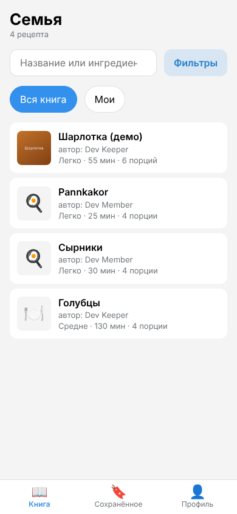
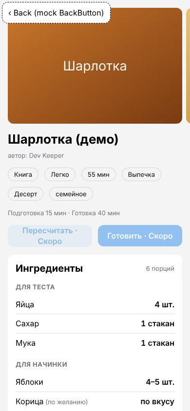
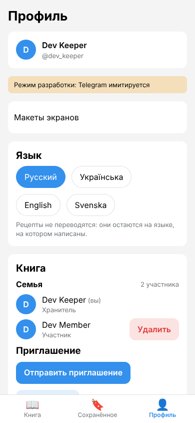

# Как посмотреть приложение на своём компьютере (Ubuntu 22.04 / 24.04)

Эта инструкция для тех, кто ни разу не работал в терминале. Вы запустите «Семейную кулинарную книгу» у себя на компьютере и откроете её в обычном браузере. Telegram при этом **имитируется**: настоящий бот не нужен, никаких токенов и паролей вводить не придётся. Всё работает только на вашем компьютере.

Первый запуск займёт 15–30 минут (в основном это скачивание программ). Следующие запуски займут около минуты.

**Что у вас уже есть и работает, переустанавливать не нужно:** Docker 29.1.3, Docker Compose 2.40.3, ваш пользователь в группе `docker`, Git 2.43.0.

---

## 1. Откройте терминал

1. Нажмите одновременно **Ctrl + Alt + T**. Откроется окно с тёмным (или светлым) фоном и строкой вроде `имя@компьютер:~$`. Это и есть терминал.
2. Команды из серых блоков ниже копируйте целиком.
3. **Вставка в терминале делается через Ctrl + Shift + V** (обычное Ctrl + V там не работает). Можно также нажать правую кнопку мыши → «Вставить».
4. После вставки нажмите **Enter** и дождитесь, пока снова появится строка с `$` в конце. Это значит, что команда закончилась.
5. Если команда спрашивает пароль (например, `sudo`), введите **пароль от вашей учётной записи Ubuntu**. Символы при вводе не видны, это нормально. Затем нажмите Enter.

## 2. Скачайте проект

Выберите **один** из двух способов.

### Способ А (рекомендуется): через Git

```bash
cd ~
git clone --branch claude/zen-brown-nifiv3 https://github.com/RocketRn/family-cookbook.git
cd ~/family-cookbook
```

- `cd ~` переходит в вашу домашнюю папку.
- `git clone …` скачивает проект в папку `family-cookbook`.
- `cd ~/family-cookbook` переходит в папку проекта. Все следующие команды выполняйте **в ней**.

Получить новую версию позже можно одной командой (в папке проекта): `git pull`.

### Способ Б: архивом ZIP через браузер

1. Откройте <https://github.com/RocketRn/family-cookbook> (ветка `claude/zen-brown-nifiv3` открыта по умолчанию).
2. Нажмите зелёную кнопку **Code** → **Download ZIP**. Файл сохранится в папку «Загрузки».
3. Откройте «Загрузки» в программе «Файлы», нажмите на архив правой кнопкой → **Извлечь** (или «Распаковать здесь»). Появится папка `family-cookbook-claude-zen-brown-nifiv3`.
4. В терминале перейдите в неё:

```bash
cd "$(xdg-user-dir DOWNLOAD)/family-cookbook-claude-zen-brown-nifiv3"
```

(`xdg-user-dir DOWNLOAD` сама находит папку «Загрузки», как бы она ни называлась.) Чтобы получить новую версию этим способом, скачайте архив заново.

**Как вернуться в папку проекта в новом окне терминала:** `cd ~/family-cookbook` (способ А) или команда из пункта 4 (способ Б).

## 3. Установите Node.js 24 и pnpm

Проекту нужен **Node.js 24**, а в системе у вас стоит **v20.18.3**. Мы поставим Node.js 24 **рядом** с системным через программу nvm («менеджер версий Node.js»). Системный Node.js останется как был.

**3.1.** Установите nvm (одна команда, скачивает и настраивает nvm в вашей домашней папке):

```bash
wget -qO- https://raw.githubusercontent.com/nvm-sh/nvm/v0.40.3/install.sh | bash
```

**3.2.** **Закройте терминал и откройте новый** (Ctrl + Alt + T): так nvm подключится. Затем снова перейдите в папку проекта (см. конец раздела 2).

**3.3.** Установите Node.js 24 и сделайте его основным:

```bash
nvm install
nvm alias default 24
node -v
```

- `nvm install` читает файл `.nvmrc` в папке проекта (там написано `24`) и ставит Node.js 24.
- `nvm alias default 24` делает его основным во всех новых окнах терминала.
- `node -v` должна показать `v24.…`. Если показывает `v20.18.3`, закройте и снова откройте терминал.

**3.4.** Включите pnpm (программа, которая ставит библиотеки проекта; она входит в состав Node.js):

```bash
corepack enable
corepack prepare pnpm@10.28.0 --activate
pnpm -v
```

`pnpm -v` должна показать `10.28.0`.

**3.5.** Проверьте, что Docker отвечает (ничего не устанавливает):

```bash
docker info --format '{{.ServerVersion}}'
```

Должно появиться `29.1.3`. Если появилась ошибка, смотрите раздел 8.

## 4. Запустите демо

В папке проекта:

```bash
pnpm demo
```

Скрипт сам проверит всё нужное и по шагам покажет, что делает. Каждый успешный шаг отмечается галочкой ✓:

```text
▶ Проверяю Node.js 24          ✓ Node.js v24…   ✓ pnpm 10.28.0
▶ Проверяю Docker              ✓ Docker 29.1.3  ✓ Docker Compose 2.40.3
▶ Проверяю порты               ✓ свободны: приложение 5173, API 3000, база 5432, фото 8333
▶ Устанавливаю зависимости     ✓ зависимости установлены
▶ Запускаю базу данных и хранилище фото   ✓ …
▶ Готовлю базу данных          ✓ таблицы созданы, тестовые пользователи, книга и рецепты загружены
▶ Запускаю приложение          ✓ API … ✓ приложение … ✓ фоновый процесс работает
▶ Публикую демо-рецепт с фотографиями
✓ Готово! Демо работает: http://localhost:5173/?devUser=1
```

- В первый раз шаги «зависимости» и «база данных» займут несколько минут: скачивается около 300 МБ.
- В конце **браузер откроется сам** на странице <http://localhost:5173/?devUser=1>. Если не открылся, скопируйте этот адрес в Firefox.
- Если что-то не так, скрипт остановится и **по-русски напишет, что делать** (например, какую команду выполнить). Смотрите также раздел 8.
- После «Готово!» терминал можно закрыть: демо продолжит работать, пока вы его не остановите (раздел 7) или не перезагрузите компьютер.
- После перезагрузки компьютера: откройте терминал, перейдите в папку проекта и снова выполните `pnpm demo`.

## 5. Что посмотреть в приложении

Сверху слева вы увидите пунктирную кнопку **«‹ Back (mock BackButton)»**. Это имитация кнопки «Назад» из шапки Telegram: она есть только в режиме разработки. В «Профиле» есть жёлтая плашка «Режим разработки: Telegram имитируется».

### 5.1. Вход

Вход происходит **автоматически**: вы вошли как «Dev Keeper», хранитель книги «Семья». Других тестовых пользователей можно открыть по адресу:

- <http://localhost:5173/?devUser=2>: «Dev Member», участник той же книги, интерфейс на английском (если вы ещё не выбирали язык вручную в этом браузере: ручной выбор важнее);
- <http://localhost:5173/?devUser=3>: новый пользователь без книги (язык из «Telegram» шведский).

### 5.2. Книга

Вкладка **«Книга»** (внизу слева) показывает список рецептов: «Шарлотка (демо)» с фото и рецепты из тестовых данных.



- Введите в поле поиска `яблок`: останутся только рецепты с яблоками (поиск ищет по названию, ингредиентам и тегам, понимает разные формы слова: «яблоки», «яблок»). Очистите поле.
- **«Фильтры»**: сложность, время, теги.
- **«Мои»**: только ваши рецепты, включая черновики.
- Кнопка **«＋»** справа от названия книги: написать рецепт или вставить его текст (разделы 5.4 и 5.5).

### 5.3. Карточка рецепта

Нажмите **«Шарлотка (демо)»**.



- **Фото вверху** листаются вбок (мышью: прокрутка колёсиком с зажатым **Shift**).
- **Теги**, время, сложность.
- **Ингредиенты по разделам** «Для теста» и «Для начинки», записаны по-русски: «4 шт.», «1 стакан», «по вкусу».
- **Шаги:**
  - у шага 1 своё фото, а количества стоят прямо в тексте: «яйца (**4 шт.**)»;
  - у шага 2 есть видео: нажмите ▶, и YouTube начнёт с 0:30 (нужен интернет); есть также кнопка «Открыть в YouTube»;
  - у шага 3 есть таймер «Духовка · 40 мин».
- Внизу заметки автора и блок **реакций** (пока серый: реакции появятся в Sprint 5).
- Под ними, если рецепт ваш: **«Редактировать»**, **«Снять с публикации»** и **«Удалить рецепт»**. Удаление и снятие с публикации сначала спрашивают подтверждение.
- Откройте также **«Голубцы»** (пример из технического задания).

**Пересчёт порций.** Нажмите **«Пересчитать»**:

1. **«По порциям»**: кнопками «−» и «+» выберите, например, 12 порций вместо 6 и нажмите «Пересчитать». Все количества удвоятся, в том числе в тексте шагов («яйца (**8 шт.**)»).
2. **«От продукта»**: выберите «Яйца», введите `3` (как будто у вас только 3 яйца) и нажмите «Пересчитать». Всё уменьшится до ¾, а сверху появится «Пересчитано · порций: ≈ 4,5».
3. У таймеров появится пометка «время может отличаться»: время готовки само не пересчитывается.
4. Обновите страницу (F5): пересчёт сохранится. Кнопка **«Вернуть как в рецепте»** всё отменит.

Если изменение слишком большое (больше чем в 4 раза), приложение предупредит. Больше чем в 20 раз пересчитать нельзя.

### 5.4. Написать свой рецепт

1. Вкладка «Книга» → **«＋»** → **«Написать рецепт»**.
2. Впишите название, выберите число порций.
3. В «Ингредиентах» впишите, например, `сахар` и количество `1`. Нажмите на кнопку справа («без ед.») и выберите единицу «стакан». Количество можно писать как `1,5`, `½` или `2–3`; там же можно выбрать «По вкусу» или «Щепотка».
4. В «Шаге 1» напишите `Взбейте яйца с `. Нажмите **«Привязать ингредиент»** → «сахар» → «Готово». Потом нажмите на появившуюся кнопку «сахар · Всё» → **«Вставить в текст»**. В тексте появится «сахар ([сахар])»: в квадратных скобках будет стоять количество. Слово можно поменять на «сахаром», а под полем видно, как это будет выглядеть: «сахаром (1 стакан)».
5. **«Добавить таймер»**: если в тексте шага есть время («5 минут»), таймер заполнится сам.
6. **«Добавить фото»**: можно выбрать любое фото с компьютера (JPEG, PNG или WebP). Большие фото уменьшаются перед загрузкой.
7. **«Опубликовать»**: рецепт появится в книге. Если чего-то не хватает, приложение скажет, что именно.

Если начать редактировать и нажать «‹ Back», приложение спросит, уйти ли без сохранения.

### 5.5. Вставить текст рецепта

1. **«＋»** → **«Вставить текст рецепта»**.
2. Скопируйте этот текст целиком и вставьте в поле (Ctrl + V):

```text
Сырники

На 4 порции

Ингредиенты:
- творог — 500 г
- 2 яйца
- 3 ст. л. сахара
- 5 ст. л. муки
- щепотка соли
- ванилин

Приготовление:
1. Смешайте творог, яйца и сахар.
2. Добавьте муку, соль и ванилин, слепите сырники.
3. Жарьте 3–4 минуты с каждой стороны.
```

3. Нажмите **«Разобрать»**. Откроется «Проверьте рецепт»: ингредиенты и шаги уже разложены по полям, у третьего шага есть таймер на 3 минуты.
4. Строка «ванилин» **выделена жёлтым** с объяснением: программа не нашла количества. Нажмите кнопку «без ед.» справа от этой строки и выберите **«Щепотка»** → «Готово»: выделение исчезнет.
5. Нажмите **«Опубликовать»**.

Текст сохраняется на компьютере, пока рецепт не создан: если закрыть страницу, вставленный текст никуда не денется.

### 5.6. Язык

**Профиль** → «Язык» → English / Українська / Svenska / Русский. Интерфейс меняется сразу. Рецепты остаются на том языке, на котором написаны (так задумано). Выбор запоминается в браузере и сохраняется в профиле.



### 5.7. Тёмная и светлая тема

- Тёмная: <http://localhost:5173/?devUser=1&theme=dark>
- Светлая: <http://localhost:5173/?devUser=1&theme=light>
- Без `theme=` тема следует настройке Ubuntu («Настройки» → «Внешний вид»). В Telegram цвета будут приходить из самого Telegram.

### 5.8. Вступление в книгу по ссылке-приглашению

Так работает ссылка, которую хранитель отправляет родственнику в Telegram. Откройте:

<http://localhost:5173/?devUser=3&startapp=join_devinvitecode>

Появится «Присоединиться к книге?». Нажмите кнопку, и новый пользователь окажется в книге «Семья» с её рецептами.

### 5.9. Создать свою книгу

Нужен пользователь, который ещё не в книге. Выполните `pnpm demo:reset` (раздел 7), затем `pnpm demo`, и откройте <http://localhost:5173/?devUser=3>. На экране приветствия введите название и нажмите «Создать книгу». Там же можно войти по коду `devinvitecode`.

Почему нужен сброс: человек может состоять только в **одной** книге. Если в 5.8 пользователь 3 уже вступил в «Семью», приложение ответит «Вы уже состоите в книге».

Язык этого пользователя шведский (как будто так настроен его Telegram). Но если вы уже выбирали язык в этом браузере, будет выбранный язык.

### 5.10. Сохранённое

Вкладка **«Сохранённое»**: в демо там два рецепта с пометкой «Пример для разработки». Настоящее сохранение рецептов появится в Sprint 5; в рабочей версии здесь пока пустая полка.

### 5.11. Макеты будущих экранов

**Профиль** → **«Макеты экранов»**, или прямо: <http://localhost:5173/dev/review> и <http://localhost:5173/dev/cook>.

- **«Проверка импорта»** (полная версия в Sprint 4): исходный текст рядом с результатом, принять или отклонить найденные таймеры.
- **«Режим готовки»** (Sprints 4–5): переключайте сверху «Подготовка», «Шаг», «Таймеры», «Готово», «Проблемы». Крупный текст, большие кнопки «Назад» / «Следующий шаг», таймеры внизу экрана.

Ничего из введённого здесь не сохраняется. В рабочей версии этих экранов нет.

**Не нажимайте «Отправить приглашение»** в Профиле: в демо эта кнопка откроет сайт Telegram для пересылки ссылки, а ссылка там тестовая.

## 6. Как посмотреть в размере телефона

**Firefox** (браузер Ubuntu по умолчанию):

1. Нажмите **F12** (откроются инструменты разработчика).
2. Нажмите **Ctrl + Shift + M**: включится режим адаптивного дизайна (окно в размере телефона).
3. Сверху выберите телефон из списка (например, iPhone) или впишите размер **390 × 844**.
4. Нажмите **F5**, чтобы обновить страницу.
5. Закрыть: снова **F12**.

**Google Chrome / Chromium:**

1. Нажмите **F12**, затем **Ctrl + Shift + M** («Toggle device toolbar»).
2. Сверху выберите телефон из списка (например, iPhone) или впишите размер **390 × 844**.
3. Нажмите **F5**.

## 7. Остановить, снова запустить, стереть данные

| Что нужно                                        | Команда (в папке проекта) |
| ------------------------------------------------ | ------------------------- |
| Остановить демо (данные сохранятся)              | `pnpm demo:stop`          |
| Снова запустить                                  | `pnpm demo`               |
| Стереть все данные демо и начать с чистого листа | `pnpm demo:reset`         |

`pnpm demo:reset` сначала спросит подтверждение: введите **да** и нажмите Enter. Удаляются только данные демо (рецепты, книги, фото, журналы); код проекта не меняется. Выбранные номера портов сохраняются.

## 8. Если что-то пошло не так

| Что вы видите                                                                                               | Почему                                                                  | Что сделать                                                                                                                                                                                                   |
| ----------------------------------------------------------------------------------------------------------- | ----------------------------------------------------------------------- | ------------------------------------------------------------------------------------------------------------------------------------------------------------------------------------------------------------- |
| «У вашего пользователя нет прав на Docker» или `permission denied … docker.sock`                            | пользователь не в группе `docker`, или вы не перезашли после добавления | `sudo usermod -aG docker $USER`, затем выйдите из системы и войдите снова (или перезагрузите компьютер)                                                                                                       |
| «Служба Docker не запущена» / `failed to connect to the docker API` / `Cannot connect to the Docker daemon` | Docker выключен                                                         | `sudo systemctl start docker`. Чтобы включался сам: `sudo systemctl enable docker`                                                                                                                            |
| «Порт 5432 уже занят другой программой»                                                                     | на компьютере уже работает другая база данных PostgreSQL                | `POSTGRES_PORT=5433 pnpm demo`. Порт запомнится. Так же для других портов: `DEMO_WEB_PORT=5174` (приложение), `DEMO_API_PORT=3001` (API), `S3_PORT=8334` (фото). Кто занял порт: `sudo ss -ltnp \| grep 5432` |
| «Нужен Node.js 24, а сейчас: v20.18.3»                                                                      | терминал открыт до установки nvm, или Node.js 24 не сделан основным     | `nvm alias default 24`, затем закройте и откройте терминал. Если `nvm: команда не найдена`, откройте новый терминал; если не помогло, повторите шаг 3.1                                                       |
| `pnpm: команда не найдена` или «Не найден pnpm»                                                             | pnpm не включён для Node.js 24                                          | выполните шаг 3.4. Запасной вариант без pnpm: `bash scripts/demo.sh` (скрипт сам найдёт Node.js 24 через nvm)                                                                                                 |
| `which node` показывает `/snap/bin/node`                                                                    | Node.js установлен ещё и как snap-пакет и мешает nvm                    | откройте новый терминал (nvm идёт первым). Если всё равно snap: `sudo snap remove node` (только если этот Node.js вам не нужен для других программ)                                                           |
| `which docker` показывает `/snap/bin/docker`, ошибки про файлы или папки                                    | Docker из snap видит только домашнюю папку                              | держите папку проекта внутри домашней папки (`~/family-cookbook`). Не ставьте второй Docker поверх `docker.io`                                                                                                |
| «Не удалось установить зависимости»                                                                         | нет интернета или он оборвался                                          | проверьте интернет и снова `pnpm demo`                                                                                                                                                                        |
| Браузер не открылся                                                                                         | нет программы по умолчанию для ссылок                                   | откройте Firefox и введите `http://localhost:5173/?devUser=1`                                                                                                                                                 |
| В браузере «Не удалось войти» или страница не открывается                                                   | что-то из приложения остановилось                                       | `pnpm demo:stop`, затем `pnpm demo`                                                                                                                                                                           |
| Нет фотографий в рецепте                                                                                    | остановилось хранилище фото                                             | `pnpm demo:stop`, затем `pnpm demo`                                                                                                                                                                           |
| Видео не играет                                                                                             | нет интернета или YouTube недоступен                                    | нажмите «Открыть в YouTube» или проверьте интернет                                                                                                                                                            |
| Что-то другое                                                                                               | —                                                                       | пришлите мне последние 20 строк из терминала и файлы из папки `.demo/logs/` в папке проекта                                                                                                                   |

## 9. Чего это демо НЕ показывает (честно)

- **Настоящий Telegram.** Здесь Telegram только имитируется в браузере. Чего здесь нет:
  - запуска из Telegram и настоящего входа;
  - кнопок и цветов самого Telegram;
  - сообщений от бота (бот ещё не создан).
- **Настоящие телефоны.** Как приложение ведёт себя на iPhone и Android: клавиатура, жесты, воспроизведение YouTube внутри Telegram, экран во время готовки. Это проверяется отдельно на устройствах.
- **Настоящие фото с телефона.** Фото в демо-рецепте сгенерированы скриптом. Свои фото с компьютера загружать уже можно (раздел 5.4). Как ведут себя снимки iPhone (формат HEIC, поворот), проверим на устройстве.
- **Режим готовки и таймеры.** Пока это только макеты (раздел 5.11): настоящие таймеры с сообщением от бота появятся в Sprints 4–5.
- **Настоящий сервер.** Всё работает только на вашем компьютере: скорость в интернете, резервные копии и работа нескольких человек одновременно здесь не видны. Все «пользователи» — это имитация на одном компьютере.

**Безопасность.**

- Демо использует только поддельные тестовые ключи.
- Базой, хранилищем фото и приложением можно пользоваться только с этого компьютера: они не открыты в локальную сеть.
- Браузер загружает из интернета только официальный скрипт Telegram (как любой сайт с Telegram) и видео YouTube, когда вы нажимаете ▶. Никакие ваши данные никуда не отправляются.
